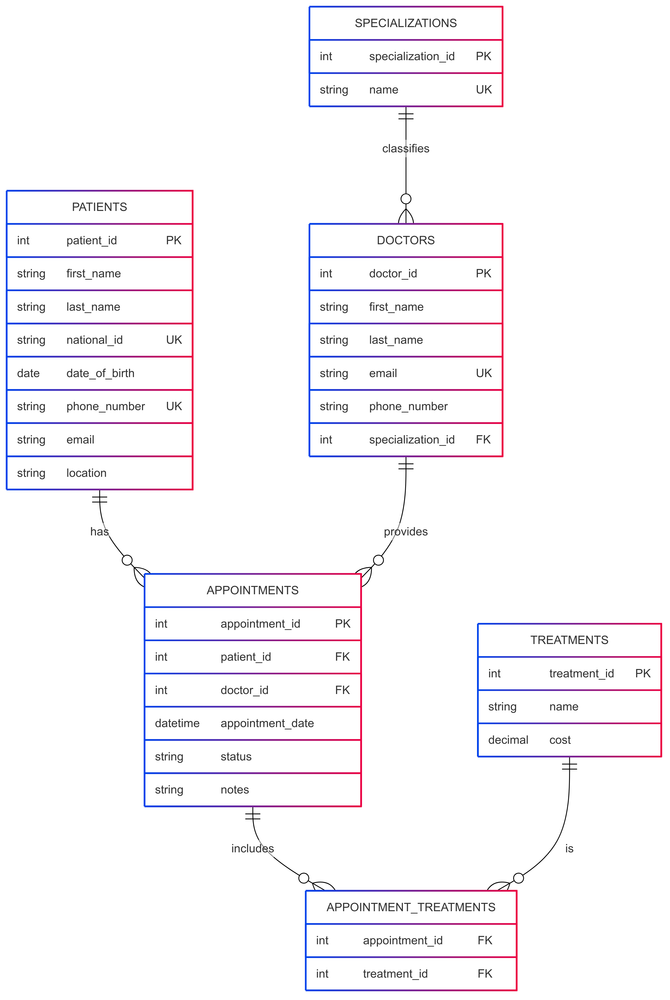

# Kenyan Clinic Management System


```markdown

## Project Description
A comprehensive database system for managing patient records, doctor appointments, and treatments in a Kenyan clinical setting. The system tracks patient visits, doctor specializations, and treatments administered with a focus on common Kenyan healthcare scenarios.

## Features
- Patient registration with Kenyan national ID tracking
- Doctor management with specialization
- Appointment scheduling system
- Treatment cost management in Kenyan Shillings
- Relationship tracking between appointments and treatments
- Support for common Kenyan medical cases (malaria, antenatal care, etc.)

## Database Schema
The Entity Relationship Diagram above shows the complete structure of the database with all tables and relationships.

## Setup Instructions

### Prerequisites
- MySQL Server 8.0 or higher
- MySQL client (Workbench or command line)

### Installation
1. Clone this repository:
```bash
git clone https://github.com/toshlewi/clinic-database
cd kenyan-clinic-system
```

2. Run the SQL script:
```bash
mysql -u yourusername -p < clinicdb.sql
```

### Alternative Setup Using MySQL Workbench
1. Download and open the `clinicdb.sql` file in MySQL Workbench
2. Execute the entire script (Ctrl+Shift+Enter)
3. Verify all tables were created successfully

## Sample Data Included
The database comes pre-loaded with:
- 6 medical specializations common in Kenya
- 5 doctors with Kenyan names and contacts
- 5 patient records with Kenyan demographics
- 8 common medical treatments with Kenyan pricing
- 5 sample appointments with realistic scenarios

## Example Queries

### View Today's Appointments
```sql
SELECT p.first_name, p.last_name, d.first_name AS doctor_fname, 
       d.last_name AS doctor_lname, a.appointment_date
FROM Appointments a
JOIN Patients p ON a.patient_id = p.patient_id
JOIN Doctors d ON a.doctor_id = d.doctor_id
WHERE DATE(a.appointment_date) = CURDATE()
ORDER BY a.appointment_date;
```

### Calculate Monthly Revenue
```sql
SELECT MONTH(a.appointment_date) AS month, 
       SUM(t.cost) AS total_revenue
FROM Appointments a
JOIN Appointment_Treatments at ON a.appointment_id = at.appointment_id
JOIN Treatments t ON at.treatment_id = t.treatment_id
WHERE a.status = 'Completed'
GROUP BY MONTH(a.appointment_date);
```

## Kenyan-Specific Features
- National ID field for patient identification
- Kenyan phone number format validation
- Common Kenyan treatments pre-loaded (malaria tests, antenatal care)
- Sample data with Kenyan names and locations

## Author
**Lewis Gitonga**  
Nairobi, Kenya

